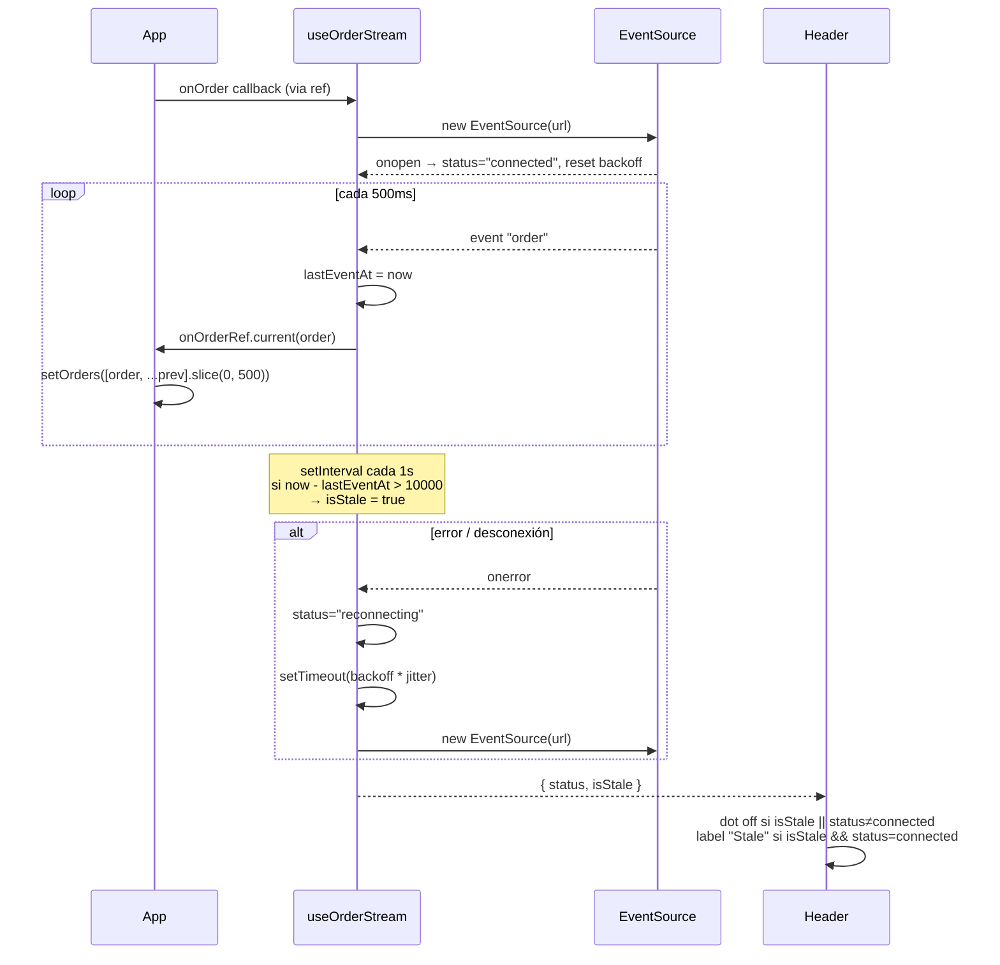

# fix: LiveBoard stability — filter persistence, performance, live indicator

## Summary

Resolver los 3 tickets de Linear (WOR-5, WOR-6, WOR-7) en una sola rama (`fix/liveboard-stability`) con un único PR contra `main`. Cada ticket aterriza en su propio commit. El plan cierra brechas entre lo que afirma el `README.md` y lo que el código realmente implementa: persistencia de filtros en `localStorage`, indicador "Live" con semántica real (heartbeat + reconexión con backoff exponencial), y performance bajo carga vía memoización selectiva, callback estable del SSE y cap de órdenes en memoria. El servidor mock no se modifica.

---

## Problem Frame

LiveBoard se entregó con una desalineación entre `README.md` y el código: el README promete `React.memo` en todos los componentes, reconexión SSE con backoff, y persistencia de filtros — y nada de eso existe. Ops ha reportado tres síntomas concretos (los 3 tickets): los filtros "se sienten" como que se resetean, la UI se ralentiza tras un rato de stream, y el indicador "Live" queda verde aunque el servidor deje de emitir. La causa raíz es la misma: el código se quedó corto respecto al spec implícito del README.

---

## Requirements

- **R1.** Los filtros del `FilterBar` (`query`, `statuses[]`, `restaurantName`) sobreviven a un page refresh (cubre **WOR-5**).
- **R2.** El test `FilterBar > persists query across remounts via localStorage` pasa sin tocar el test (cubre **WOR-5**).
- **R3.** Con 500 órdenes en pantalla y 1 evento SSE cada 500 ms, la UI mantiene interactividad: no se reabre el `EventSource` por render, los componentes que no cambian no re-renderizan, y los cálculos `filter`/`sort`/`bucketByMinute` no se ejecutan más de lo necesario (cubre **WOR-6**).
- **R4.** El array de órdenes en memoria está acotado a 500 entradas (FIFO, descartando las más viejas), de modo que el crecimiento es O(1) en steady state (cubre **WOR-6**).
- **R5.** El indicador "Live" refleja actividad reciente: si pasan más de **10 s** sin recibir un evento `order`, el indicador deja de mostrarse como conectado (cubre **WOR-7**).
- **R6.** Si el `EventSource` se cae, el hook reintenta con backoff exponencial (1s → 2s → 4s → 8s → 16s → cap 30s) y expone `ConnectionState` real (`connecting | connected | reconnecting | disconnected`) en lugar de hardcodear `"connected"` (cubre **WOR-7**).

---

## Scope Boundaries

- No se toca `server/index.js` (regla explícita del repo).
- No se introducen librerías de gestión de estado (Redux, Zustand, etc.); el estado sigue local en `App.tsx`.
- No se añade virtualización de la lista (react-window/react-virtual). El cap de 500 entradas + memoización es suficiente para el ticket; virtualizar queda como follow-up si la UX lo pide.
- No se reescribe el modelo de tipo `ConnectionState`. Se preservan los 4 valores existentes; la noción de "stale" se expone como flag derivado, no como nuevo variant.
- No se cambia la presentación visual existente (colores, layout) más allá del label "Stale" cuando aplique.

### Deferred to Follow-Up Work

- Virtualización del `OrderList` con `react-window` si el cap de 500 sigue resultando insuficiente: PR separado.
- Test de integración E2E que arranque el mock server y observe el indicador "Live" a lo largo del tiempo real: PR separado.

---

## Context & Research

### Relevant Code and Patterns

- `src/components/FilterBar.tsx` — hoy maneja los 3 filtros con `useState` y notifica al padre vía `onChange` dentro de un `useEffect`. Único `useEffect` que ya escribe estado: punto natural para añadir el sync con `localStorage`.
- `src/test/FilterBar.test.tsx` — el test `persists query across remounts via localStorage` ya está escrito y está rojo por diseño. Sirve como criterio de aceptación de WOR-5.
- `src/test/setup.ts` — ejecuta `localStorage.clear()` después de cada test, así que la persistencia no contamina entre casos.
- `src/hooks/useOrderStream.ts` — hoy: un único `useEffect` que crea `EventSource`, suscribe `order` y devuelve `status: "connected"` constante. El callback `onOrder` entra en deps y el padre pasa una arrow inline → el effect se ejecuta cada render. Este es el bug raíz que conecta WOR-6 y WOR-7.
- `src/types.ts` — define `ConnectionState = "connecting" | "connected" | "disconnected" | "reconnecting"` ya completo; nada más usa los 4 valores.
- `src/components/ConnectionStatus.tsx` y `src/components/Header.tsx` — ya mapean los 4 valores a labels visuales. Solo hace falta añadir el caso "stale".
- `src/components/OrderList.tsx` — recomputa `filter` + `sort` + crea un `Intl.NumberFormat` nuevo en cada render. Memoization target #1.
- `src/components/OrdersPerMinuteChart.tsx` — `bucketByMinute(orders)` corre en cada render. Memoization target #2. Contiene un ternario no-op (`o.status.kind === "cancelled" ? o.status.placedAt : o.status.placedAt`) heredado de una versión anterior.
- `src/components/OrderRow.tsx` — instancia `Intl.NumberFormat` y `Intl.DateTimeFormat` en cada render por cada row.
- `src/App.tsx` — calcula `restaurants` (Array.from(Set)) y pasa el callback del SSE como arrow inline.

### Institutional Learnings

- No existe `docs/solutions/` en este repo (es un challenge cerrado).

### External References

- No se invocó research externo. Los patrones aplicados son React estándar (`React.memo`, `useMemo`, `useCallback`, `useRef`, `localStorage`).

---

## Key Technical Decisions

- **Una rama / un PR / tres commits**: decisión del usuario. La rama es `fix/liveboard-stability`. Cada unit aterriza en su propio commit con mensaje `fix(WOR-X): …`. El PR final referencia los 3 tickets en el cuerpo.
- **Orden de implementación**: WOR-5 → WOR-6 → WOR-7. WOR-5 es independiente y desbloquea el test rojo existente. WOR-6 toca `useOrderStream` para estabilizar el callback — eso es prerrequisito para WOR-7, que reescribe el cuerpo del hook. Hacer WOR-7 primero invalidaría parte del trabajo de WOR-6.
- **localStorage key versionada**: `liveboard:filters:v1`. Prefijo `liveboard:` evita colisiones, sufijo `v1` permite invalidar formato sin migrar.
- **Lazy init para `useState`**: leer `localStorage` dentro del initializer de `useState` (no en `useEffect`) evita un render fantasma con valores default antes de hidratar.
- **Cap de 500 órdenes**: aplicado al hacer el prepend en `App.tsx` (`[order, ...prev].slice(0, 500)`). Punto único de truncado.
- **"Stale" se expone como flag, no como nuevo `ConnectionState`**: el hook retorna `{ status: ConnectionState, isStale: boolean }`. El componente `Header`/`ConnectionStatus` deciden la presentación: dot off cuando `isStale || status !== "connected"`, label "Stale" cuando `isStale && status === "connected"`. Esto preserva el tipo existente y mantiene la separación entre estado de socket (hecho) y semántica visual (interpretación).
- **Backoff exponencial con jitter ligero**: secuencia `1s, 2s, 4s, 8s, 16s, 30s, 30s, …` con ±20% de jitter para evitar thundering herd. Tras 10 intentos consecutivos sin éxito → `disconnected`. Si un intento conecta, se resetea el contador.
- **`useRef` para el callback del SSE**: en lugar de `useCallback` (que requiere disciplina en cada caller), guardamos el último `onOrder` en un ref. El `useEffect` que abre el `EventSource` tiene deps `[]` y siempre lee `onOrderRef.current`. Más robusto a callsites futuros.
- **Eliminar el ternario no-op de `bucketByMinute`**: cleanup pequeño que va con WOR-6 (ya estamos en ese archivo).

---

## Open Questions

### Resolved During Planning

- **Semántica de "Live"**: actividad reciente (no solo socket abierto). Threshold = 10 s.
- **¿Reconexión propia o nativa del `EventSource`?**: propia, con backoff exponencial — el README la promete y `EventSource` no permite controlar el retry.
- **Alcance de WOR-6**: memoización + callback estable + cap de 500. Sin virtualización.
- **Naming de la rama**: `fix/liveboard-stability`.
- **¿Crear `docs/plans/`?**: sí, este plan vive ahí.

### Deferred to Implementation

- **Mensaje exacto del label "Stale"**: "Stale" vs "Idle" vs "No activity". Lo decido en code review; default `"Stale"`.
- **¿Mover los `Intl.NumberFormat` a module-level?**: probablemente sí (no dependen de props), pero confirmo en implementación según ESLint/strict.
- **Test de `useOrderStream`**: añadir `src/test/useOrderStream.test.ts` con fake timers + `EventSource` mock. Si el setup resulta caro, fallback a smoke tests manuales documentados en el PR.

---

## High-Level Technical Design

> *Diagrama directional para validar shape — no es especificación de implementación.*



---

## Implementation Units

### U1. WOR-5 — Persistir filtros en `localStorage`

**Goal:** El estado de los 3 filtros (`query`, `statuses`, `restaurantName`) se restaura desde `localStorage` al montar y se persiste en cada cambio. El test rojo existente pasa.

**Requirements:** R1, R2.

**Dependencies:** Ninguna.

**Files:**
- Modify: `src/components/FilterBar.tsx`
- Test: `src/test/FilterBar.test.tsx` (verificar que pasa; añadir 1–2 escenarios extra si el ratio coverage lo amerita).

**Approach:**
- Lazy initializers para los 3 `useState`: leer `localStorage.getItem("liveboard:filters:v1")`, parsear con `JSON.parse` dentro de `try/catch`, fallback al default si falla o falta.
- Un `useEffect` adicional que, ante cambios en cualquiera de los 3, escribe el objeto serializado a `localStorage` (con `try/catch` para tolerar quota errors silenciosamente).
- El `useEffect` que notifica al padre vía `onChange` permanece igual.
- Validar shape al leer: si el JSON no tiene la forma esperada (e.g. `statuses` no es array de strings), fallback a defaults.

**Execution note:** El test fallido en `FilterBar.test.tsx` actúa como acceptance. Implementación naturalmente test-first: arrancar corriendo `pnpm test -t "persists query"` y guiar el cambio hasta verlo pasar.

**Patterns to follow:** El `useEffect` de notificación existente en `FilterBar.tsx` (deps explícitas, sin abstracciones extra). No introducir un hook custom `useLocalStorageState` — para un solo callsite es over-engineering.

**Test scenarios:**
- *Happy path:* el test existente `persists query across remounts via localStorage` pasa.
- *Happy path:* escribir un `query`, togglear 2 `statuses`, seleccionar `restaurantName`, remontar — los 3 valores se restauran.
- *Edge case:* `localStorage` con string no-JSON → no rompe; arranca con defaults.
- *Edge case:* `localStorage` con JSON válido pero shape inválido (e.g. `statuses: "pending"` string en vez de array) → arranca con defaults.
- *Edge case:* `setItem` lanza (modo privado/quota) → no rompe la UI; la persistencia falla silenciosa.

**Verification:**
- `pnpm test src/test/FilterBar.test.tsx` pasa con los 3 casos en verde.
- Manual: escribir filtros, refresh navegador, filtros restaurados.
- `pnpm lint` + `pnpm build` sin errores.

---

### U2. WOR-6 — Performance bajo carga (cap + callback estable + memoización)

**Goal:** Con 500 órdenes en pantalla y 1 evento SSE cada 500 ms, la UI no se ralentiza: el `EventSource` no se reabre, los rows que no cambian no se re-renderizan, y `filter`/`sort`/`bucketByMinute` no se recomputan si el input no cambió. El array de órdenes nunca pasa de 500.

**Requirements:** R3, R4.

**Dependencies:** U1 (orden de commits; no es bloqueo técnico).

**Files:**
- Modify: `src/App.tsx`
- Modify: `src/hooks/useOrderStream.ts`
- Modify: `src/components/OrderList.tsx`
- Modify: `src/components/OrderRow.tsx`
- Modify: `src/components/OrdersPerMinuteChart.tsx`
- Test: ninguno nuevo (la verificación es manual + smoke). Si hay tiempo, snapshot de render counts con `@testing-library/react` `rerender`.

**Approach:**
- **Callback estable del SSE.** En `useOrderStream`, introducir `onOrderRef = useRef(onOrder)` actualizado en cada render. El `useEffect` que crea `EventSource` queda con deps `[]` y llama `onOrderRef.current(order)`. El `EventSource` deja de reabrir.
- **Cap de órdenes.** En el handler de `App.tsx`, `setOrders((prev) => [order, ...prev].slice(0, 500))`. Constante exportada `MAX_ORDERS_IN_MEMORY = 500` para que el número sea descubrible.
- **Memoización de componentes:**
  - `OrderRow` → `React.memo` (función pura sobre `order`).
  - `OrderList` → `React.memo` (props son `orders` y `filters`; ambos cambian referencialmente solo cuando deben).
  - `OrdersPerMinuteChart` → `React.memo`.
- **Memoización de cálculos:**
  - En `OrderList`: `useMemo` para `filtered` (deps `[orders, filters]`); `useMemo` para `totalRevenue`.
  - En `OrdersPerMinuteChart`: `useMemo` para `data = bucketByMinute(orders)` (deps `[orders]`).
  - En `App`: `useMemo` para `restaurants` (deps `[orders]`).
- **Formatters Intl a module-level.** Mover `new Intl.NumberFormat(...)` y `new Intl.DateTimeFormat(...)` de `OrderRow` y `OrderList` a constantes module-scope. No dependen de props.
- **Cleanup del ternario no-op** en `OrdersPerMinuteChart.bucketByMinute`.

**Execution note:** Verificar paso a paso con DevTools "Highlight updates" / React Profiler entre cambios; medir antes y después con el dev server abierto.

**Technical design:** *(directional, no especificación)*

```text
useOrderStream:
  const onOrderRef = useRef(onOrder);
  useEffect(() => { onOrderRef.current = onOrder; });
  useEffect(() => {
    const es = new EventSource(URL);
    es.addEventListener("order", e => onOrderRef.current(JSON.parse(e.data)));
    return () => es.close();
  }, []);  // ← deps vacías, el ref se encarga del refresh

App:
  const handleOrder = useCallback((order) => {
    setOrders(prev => [order, ...prev].slice(0, MAX_ORDERS_IN_MEMORY));
  }, []);
  const { status } = useOrderStream(handleOrder);
  const restaurants = useMemo(() => Array.from(new Set(orders.map(o => o.restaurantName))).sort(), [orders]);
```

**Patterns to follow:**
- `React.memo` con shallow compare por defecto (no inventar comparadores custom; los props son referencialmente estables después de los cambios anteriores).
- `useMemo`/`useCallback` con dependency arrays explícitas — `noUnusedParameters` y `noUncheckedIndexedAccess` ya están activos, así que no me ahorro deps.

**Test scenarios:**
- *Happy path:* tests de `FilterBar` siguen pasando (no se afecta lógica de UI fuera del scope).
- *Edge case:* al recibir la orden #501, la #1 se descarta. El `OrderList` muestra la nueva en el tope y nunca más de 500 entradas.
- *Smoke (manual):* abrir el dev server, dejar correr el SSE 2–3 min, scroll por la lista — sin jank notable. Comparar antes/después con React Profiler.

**Verification:**
- React Profiler: durante un evento SSE, solo el `OrderList` (memoizado) y el rendering del nuevo `OrderRow` se reportan; los componentes no afectados no figuran.
- DevTools Network: una sola conexión a `/api/orders/stream` durante toda la sesión (antes había una nueva por render).
- `pnpm test` y `pnpm build` siguen en verde.
- En la consola: `orders.length` (vía un breakpoint o log temporal) no supera 500.

---

### U3. WOR-7 — `ConnectionState` real + reconexión con backoff + heartbeat

**Goal:** El hook `useOrderStream` expone el estado real del socket y un flag `isStale` basado en actividad. Si el socket se cae, reintenta con backoff exponencial. El indicador en el `Header` deja de mostrarse como conectado cuando no hay actividad reciente (>10 s) o cuando el socket no está abierto.

**Requirements:** R5, R6.

**Dependencies:** U2 (el ref-based callback ya está en su lugar; este unit construye sobre eso).

**Files:**
- Modify: `src/hooks/useOrderStream.ts`
- Modify: `src/components/Header.tsx`
- Modify: `src/components/ConnectionStatus.tsx`
- Modify: `src/App.tsx` (consumir `isStale` además de `status`)
- Test: `src/test/useOrderStream.test.ts` (nuevo). Si el setup del mock de `EventSource` resulta excesivo, documentar smoke tests manuales en el PR.

**Approach:**
- **Connection state.** Reemplazar `status: "connected"` hardcoded por `useState<ConnectionState>("connecting")`.
  - `onopen` → `setStatus("connected")`, resetear backoff a 0.
  - `onerror` → cerrar el `EventSource` actual, `setStatus("reconnecting")`, schedule retry.
  - Si 10 intentos consecutivos fallan → `setStatus("disconnected")` y dejar de reintentar (el user puede refrescar).
- **Backoff exponencial con jitter.** Secuencia `1000, 2000, 4000, 8000, 16000, 30000, 30000, …` ms. Cada delay multiplicado por `1 + (Math.random() - 0.5) * 0.4` (jitter ±20%). Variables locales del effect, no estado React.
- **Heartbeat / staleness.** Mantener `lastEventAtRef = useRef(Date.now())`. Cada vez que llega un evento `order`, actualizar el ref. Un `useEffect` separado lanza `setInterval` de 1 s que compara `Date.now() - lastEventAtRef.current > 10_000`; si excede, `setIsStale(true)`. Al recibir un evento nuevo, `setIsStale(false)`.
- **Return shape:** `{ status: ConnectionState, isStale: boolean }`.
- **Header / ConnectionStatus:** el dot está "on" solo cuando `status === "connected" && !isStale`. El label del `ConnectionStatus` muestra `"Stale"` cuando `isStale && status === "connected"`, y mantiene los labels existentes en los otros casos.
- **Constante `STALE_THRESHOLD_MS = 10_000`** exportada para descubribilidad.

**Execution note:** Si se opta por tests con fake timers, escribir el test del staleness primero — es el caso de UX más sutil y un test guía la implementación con menos riesgo.

**Technical design:** *(directional)*

```text
useOrderStream:
  state: status: ConnectionState ("connecting" inicialmente)
  state: isStale: boolean (false)
  refs: onOrderRef, esRef, retryTimerRef, attemptRef, lastEventAtRef

  connect():
    es = new EventSource(URL)
    es.onopen = () => { setStatus("connected"); attemptRef.current = 0 }
    es.addEventListener("order", e => {
      lastEventAtRef.current = Date.now()
      setIsStale(false)
      onOrderRef.current(JSON.parse(e.data))
    })
    es.onerror = () => {
      es.close()
      if (attemptRef.current >= MAX_ATTEMPTS) {
        setStatus("disconnected")
        return
      }
      setStatus("reconnecting")
      const delay = backoffDelay(attemptRef.current++)
      retryTimerRef.current = setTimeout(connect, delay)
    }

  useEffect(() => { connect(); return cleanup }, [])
  useEffect(() => {
    const id = setInterval(() => {
      if (Date.now() - lastEventAtRef.current > STALE_THRESHOLD_MS) setIsStale(true)
    }, 1000)
    return () => clearInterval(id)
  }, [])

  return { status, isStale }
```

**Patterns to follow:**
- Cleanup encadenado en `useEffect`: cerrar `EventSource`, `clearTimeout` del retry, `clearInterval` del heartbeat.
- `useRef` para todo lo que no debe gatillar render (timers, contadores, last-event-at).

**Test scenarios:**
- *Happy path:* hook se monta → `status = "connecting"` inicialmente, transiciona a `"connected"` cuando se emite `onopen`.
- *Happy path:* recibir un evento `order` resetea `isStale` a `false` y actualiza `lastEventAt`.
- *Edge case:* fake timer avanza 10.5 s sin eventos → `isStale = true`.
- *Edge case:* tras `isStale = true`, llega un evento → `isStale = false`.
- *Error path:* `onerror` antes de `onopen` → `status = "reconnecting"`, retry scheduled.
- *Error path:* 10 errores consecutivos sin `onopen` → `status = "disconnected"`, no más retries.
- *Cleanup:* unmount cierra `EventSource` y limpia timers (no leaks).
- *UI (ConnectionStatus.tsx):* render con `status="connected", isStale=true` → label "Stale", dot off.
- *UI (ConnectionStatus.tsx):* render con `status="reconnecting"` → label "Reconnecting…", dot off.

**Verification:**
- `pnpm test src/test/useOrderStream.test.ts` (o smoke manual documentado) en verde.
- Manual (golden path): arrancar `pnpm dev`, ver "Live" + dot verde. Matar el server (`pkill -f server/index.js`). El indicador pasa a `Reconnecting…` y eventualmente a `Disconnected` tras 10 intentos. Levantar server otra vez → recuperación automática.
- Manual (staleness): con server corriendo, hacer pausa al `setInterval` del server (vía dev tools no es trivial — alternativa: bajar la tasa de emisión modificando temporalmente el server en un fork local, **sin** commitearlo). El indicador pasa a "Stale" tras 10 s.
- `pnpm test`, `pnpm lint`, `pnpm build` en verde.
- `README.md` ya no miente: las afirmaciones sobre reconexión con backoff exponencial reflejan código real.

---

## System-Wide Impact

- **Interaction graph:** `useOrderStream` deja de re-ejecutar su `useEffect` por cada render del padre. Cualquier consumidor futuro del hook hereda esa estabilidad.
- **Error propagation:** los errores del `EventSource` ya no quedan silenciados — se reflejan en `status: "reconnecting" | "disconnected"`. Si `localStorage.setItem` falla, la UI no rompe; el error queda silenciado por diseño (no hay UX para mostrarlo).
- **State lifecycle risks:** el cap de 500 órdenes implica que un usuario que llegue tarde no ve históricamente todo; eso es aceptable para un dashboard real-time y el ticket lo asume. Los timers en `useOrderStream` (`setTimeout` de retry, `setInterval` de heartbeat) deben limpiarse en unmount — incluido cuando el unmount ocurre durante una espera de retry.
- **API surface parity:** el contrato del hook cambia: ahora retorna `{ status, isStale }`. `App.tsx` y `Header.tsx` se actualizan; no hay otros consumidores en el repo. `ConnectionStatus.tsx` empieza a recibir un signal extra implicit (el label "Stale" cuando aplique).
- **Integration coverage:** tests unitarios cubren `FilterBar` (U1) y `useOrderStream` (U3); la integración global se valida con smoke manual.
- **Unchanged invariants:** `server/index.js` no se modifica. El shape de `Order`, `OrderStatus`, `OrderItem` se preserva. Los tipos `ConnectionState` y `Filters` mantienen su definición.

---

## Risks & Dependencies

| Risk | Mitigation |
|------|------------|
| Test de `useOrderStream` con fake timers + mock de `EventSource` resulta costoso en setup | Fallback a smoke tests manuales documentados en el PR; el riesgo es solo cobertura, no funcionalidad. |
| Cap de 500 órdenes esconde un overflow real de uso (cliente con 5000+ órdenes/hr) | Documentar el cap como `MAX_ORDERS_IN_MEMORY` y mencionarlo en el PR; virtualización queda en Follow-Up. |
| Backoff infinito si el servidor está caído durante horas | Cap de 10 intentos → `disconnected`. El usuario refresca manualmente; documentado en la UX. |
| `localStorage` no disponible (modo privado, navegador exótico) | `try/catch` en lectura y escritura; fallback a defaults sin romper. |
| Cambio del shape del retorno de `useOrderStream` rompe consumers no vistos | El repo tiene un único consumer (`App.tsx`); `tsc -b` ataja cualquier omisión. |
| Mover `Intl.*` a module-level ejecuta el constructor en import — cambio de orden de side effects | Es seguro: el constructor de `Intl.NumberFormat` no tiene side effects observables; ESM imports están bien definidos. |

---

## Documentation / Operational Notes

- Actualizar `CLAUDE.md` para reflejar que las brechas README↔código quedaron cerradas (eliminar la sección "Known gaps" o anotar qué quedó pendiente).
- El cuerpo del PR enumera: tickets cerrados (WOR-5, WOR-6, WOR-7), constantes nuevas (`MAX_ORDERS_IN_MEMORY`, `STALE_THRESHOLD_MS`, `MAX_RECONNECT_ATTEMPTS`), y screenshots/gif del comportamiento del indicador "Live" (matar server → reconectar).
- Mover tickets de Linear: WOR-5 a `In Progress` al iniciar U1, los 3 a `In Review` al abrir el PR. No usar `Fixes WOR-X` (sin auto-close, por decisión del usuario).

---

## Sources & References

- **Tickets:** [WOR-5](https://linear.app/workspace-jonathan-ramirez/issue/WOR-5/filtros-no-persisten-tras-page-refresh), [WOR-6](https://linear.app/workspace-jonathan-ramirez/issue/WOR-6/performance-degrada-con-muchas-ordenes), [WOR-7](https://linear.app/workspace-jonathan-ramirez/issue/WOR-7/indicador-live-incorrecto)
- **Repo conventions:** `CLAUDE.md` (sección "Known gaps between README and code")
- **README intent:** `README.md` (sección "Architecture" y "Known issues")
